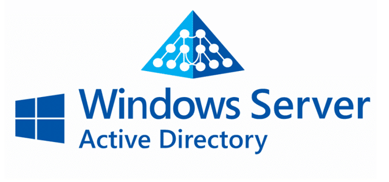
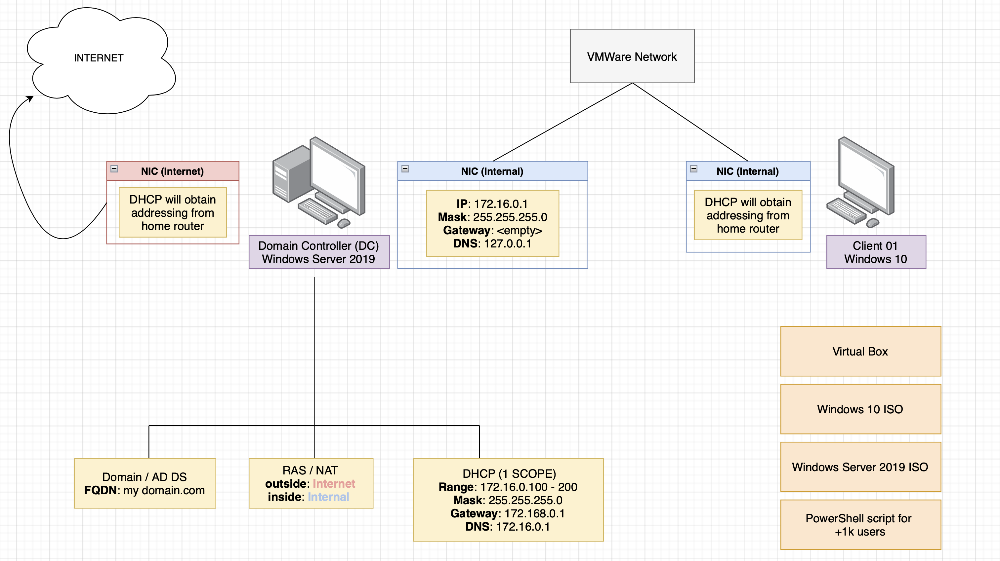

# How to setup a Windows Active Directory (within Virtual Box) to create a corporate network.
### Learning Objectives:
1. We will learn how to provision multiple virtual machines.
2. Configure a basic Windows networking environment with Active Directory.
3. Execute PowerShell script to further our Active Directory environment. 

### Technologies and Protocols:
* Oracle Virutal Box
* Window's Active Directory
* Window's networking: Domain controler, DHCP and NAT
* Powershell 

### Overview:

Pictured above is a high-level overview of our corporate network. First, we are going to download Virtual Box, Windows 10 and Windows server 2019 ISO files (**see below**). Then, we are going to create our first virtual machine with Windows server 2019 installed. This will act as our doamin controller (DC) and where we will house Active Directory (AD). We are going to give our DC two network interface cards (NICs): one will connect to the external  `internet` the other will be for the  `internal` network so that the Windows 10 clients can connect through and reach the internet.

We will assign IP addressing for the internal network, while the external network automatically gets IP addressing from your home network. After assinging IPs we will create our domain thorugh Active Directory, configure network address translation (NAT) and setup Dynamic Host Configuration Protocol (DHCP) for internet connectivity.

Finally, we will download and run a PowerShell script that will automatically create +1k users in Active Directory to simumlate our enterprise users. 

After completing our DC virtual machine, we will create another virtual machine that will be our Windows 10 client. This client machine will connect to our  `internal` network through our DC's domain name (eventually reaching the  `internet`). 

## Step 1: [Download: Virtual Box](https://www.virtualbox.org/wiki/Downloads "Virtual Box"), [Windows '19 server ISO](https://www.microsoft.com/en-us/evalcenter/download-windows-server-2019 "Windows '19 server ISO") and [Windows 10 ISO](https://www.microsoft.com/en-us/evalcenter/download-windows-server-2019 "Windows 10 ISO").
- Virtual box (download ‘VM Virtual Box Extension Pack’ found on the same page as Virtual Box for your host machine download )
- ISO: Windows Server and Windows 10
    - Set RAM (2048 MB is fine enough) and memory (30 GB is fine) to your needs.
- Create a virtual hard disk now
- VDI
- Dynamically allocate
    - Under settings > general > advance set ‘shared clipboard’ and ‘drag’n’drop’ to bidirectional (drag files + copy/paste from host machine)
    
 

## Step 2: Our goal is to have two NICs (network interface cards); one for the intranet and one for the internet.
- Under settings > network > Adapter 2 tab: select Internal Network. This will connect our machine to the intranet (internal network).
- The Adapter 1 tab is set to NAT network by default (our connection to the internet).
       

## Step 3: Upload ISO server onto our newly created domain controller VM.
- Go to settings > storage and click the blue disk/CD image. 
- Click ‘Choose a disk file…’ and upload the server ISO from where you saved it to.

## Step 4 Configure your new Windows server machine (selecting standard desktop experience).
- This may take a while

> Windows DC
> 
> **Username: Administrator**
>
> **Password: Password1**
> 
> If asked to Press Ctrl+Alt+Delete to Unlock the home page click Input from the top of the page > keyboard > Insert Ctrl+Alt+Delete (these instructions are for a Mac host machine, but similar instructions for a Windows Host).

## Step 5: Install windows guest additions 64
- First, click Devices (found on top of the screen, on Mac) > insert guest additions CD image
- Click file explorer > this pc and double click CD Drive (D:) Virtual Box Guest Additions
- Double click and install BoxWindowsAdditions-amd64

## Step 6: Set up NIC - internal connection 
- Click the little computer symbol found in the bottom right of the screen
- Choose ‘undefined network’ > change adapter options
- We should see two networks on this machine. Re-name the left most inter-net and the second one intra-net.
- *Inter-net is our NIC to the internet and intra-net is our NIC to our internal network.*

## Step 7: After re-naming, we need to assign an IP to intra-net (DHCP automatically gives inter-net an IP).
- Right-click intra-net > properties  > double click internet protocol version (TCP/IPv4)
- Assign IPs as seen in screenshot below:

## Step 8: Re-name this PC
- Right-click the start window found at the bottom left > system > rename this pc
- Re-name to DC (domain controller)
- Restart your VM

## Step 9A: Install Active Directory Domain Services
- Search for server manager > click Add roles and features and click next
- Under installation, type click role-based or feature-based installation and click next
- Under server, select ‘select a server from the server pool’ and choose our only server option and click next

## Step 9B: Under server roles, click Active Directory Domain Services and click Add Features
- Under Features, click next to skip, and under AD DS click next to skip. 
- Under the Confirmation tab, click Install

## Step 10A: Create our domain after installing the domain service software
- Open the Server Manager dashboard, click on the yellow notification icon on top and click Promote this server to a domain controller
- Under Deployment Configuration, select Add a new forest and name the Root domain mydomain.com. Click next.
- Under Domain Controller Options, input and confirm your password (**Password1**). Click next

## Step 10B: Under DNS Options, click next to skip.
- Under Additional Options, click next to skip.
-  Under Paths, click next to skip.
-  Under Review Options, click next to skip.
-  Finally, under Prerequisites Check,  click Install. The system will restart.
-  Sign in to the newly created MYDOMAIN\Administrator account **Password1**

## Step 11A: Create a dedicated Admin Account
- Click Start > Windows Administrative Tools > Active Directory Users and Computers 
- Right-click mydomain.com and click > New > Organizational Unit. Uncheck the box, and name it Admins.
- Right-click the new folder Admins and click > New > User

## Step 11B: Fill out first and last name.
- Choose and confirm the password **Password1**, uncheck User must change the password at next logon, and *CHECK* Password never expires. Click next. Click Finish.

> Make note of your full name AND user logon name for furture use

## Step 12: Make our user Admin
- Right-click our new admin and click > Properties > Member Of and click Add
- Enter domain admins into the field and click Check Names off to the right. It should resolve into Domain Admins.
- Click > Ok > Apply > Ok  
- Sign out 

## Step 13: Re-login with Domain Admin account
- Select Other User and log in with the admin credentials we created earlier 
- **Password1**

## Step 14A: Install Remote Access Server (RAS) and Network Address Translation (NAT): This allows our Windows clients to access the private (internal) network as well as the internet through our domain controller. 
- Search and open Server Manager. From the dashboard click > Add roles and Features > next > next 
- Under Server Selection select our server and click next
- Under Server Roles select Remote Access and click next
- Under Features click next
- Under Role Services check Routing and click Add Features
- Click next until you reach Results > click install

## Step 14B: Now to install NAT
- On Server Manager Dashboard click Tools from the top of the window > Routing and Remote Access
- Right-click DC (local) > Configure and Enable Routing and Remote Access > next > select Network address translation (NAT) and click next
- If you do not see any Network Interfaces click cancel and click Tools to repeat the steps one more time.

## Step 14C: Install NAT (cont.)
- Select Use this public interface to connect to the internet and choose INTER-net (IP address x.x.x.x DHCP)
- Click next > finish
- After some time, DC (local) icon should show and green arrow

## Step 15A: Set up a DHCP server on Domain Controller (in order to resolve an IP and connect to the internet for the client).
- Server Manager Dashboard > Add Roles and Features click > next until you reach Server Roles
- Under Server Roles check the box DHCP server and click Add features.
- Click next until > install

## Step 15B: Go back to Server Manager Dashboard and click > Tools > DHCP
- Click dc.domain.com and right-click IPv4 > new scope
- Click next and name: 172.16.0.100-200 and click next
- with a little faith, match the start and IPs as pictured, as well as the length and subnet mask. 
- Click next > next; under Configure DHCP Options select yes and hit next
- Set the default gateway IP address as 172.16.0.1 and click ADD. Click next
- Click next until you reach and click FINISH

## Step 15C: Right-click dc.domain.com > authorize
- Right-click IPv4 > refresh
- The icons should turn green as pictured 

## Step 16: Enable web browsing on local DC
- Server Manager > Dashboard > Configure this local server
- Click ‘on’ option for IE Enhanced Security Configuration 
- Select the OFF option for both Administrators and Users

## Step 17A: Use Power Shell script to create client users (instead of manually creating them).
- [Powershell Script](https://github.com/joshmadakor1/AD_PS "Powershell Script")
- On the GitHub link, click > code and download ZIP (save it to the desktop)
- Open the folder and open names.txt (text file with randomly generated names), and add your name to the top of the file.
- Click file > save and close the file

## Step 17B: Click start > right-click PowerShell ISE > Run as Administrator 
- Click file > open > AD_PS-master (from desktop) > 1_CREATE_USERS 
- Now to enable the execution of scripts in PowerShell: on the command line write Set-Execution Policy Unrestricted and click Yes to All when prompted 

> Some explanation to Create Users script: the script creates users (New-Aduser) and gives them the user name found in names.txt file
> ($USER_FIRST_LAST_LIST = Get-content .\names.txt); additionally their passwords are set to Password1 ($PASSWORD_FOR_USERS = Password1)

## Step 17C: Let’s execute our script 
- On the command line, let’s change our directory to execute our code: cd C:\users\your-username\desktop\AD_PS-master
- Your-username should begin with “a-“. TIP: use the TAB to auto-complete.
- From the top, hit the green play button icon to run the script. Click Run once when prompted
- Viola! The user accounts should be created in real-time.
- Go back to Server Manager > Dashboard and click tools > Active Directory Users and Computers. Right-click mydomain.com and click refresh. Under the _USERS folder within mydomain.com, we can confirm our newly created users.
- If you right-click the _USERS folder > find… we can search for specific users and edit their settings. Try searching for yourself and play around!

# Time to create our **Windows 10 Client** in Virtual Box.

### Step 1: Head back into virtual box and click > new; name it CLIENT1 with a version of Windows 10 (64-bit). Click Continue. 
- 2048 MB of RAM is fine.
- Create a virtual hard disk now
- VDI
- Dynamically allocated
- Under settings > advance set Shared Clipboard and Drag’n’Drop to Bidirectional 
- Under system > Network select Internal Network (instead of using our home network with NAT, we are going to use our internal ’corporate’ network)
- Double-click CLIENT1 to start up and click the folder icon with the green arrow
- Click add disk image and find your Windows 10 ISO file to upload

## Step 2: Install and set up CLIENT1
- Custom install 
- I don’t have a product key
- (If prompted select Windows 10 Pro)
- (If prompted select join Domain)
- Name: user, on password click next
- Turn off all services and Cortona

## Step 3: Let’s test connectivity (remember, we are using the DC as our default gateway to connect us to the internet)
- Search and open the command prompt
- On the command line: ping www.google.com
- If zero packets are lost this means a couple of things; (1) our DNS resolved and our DNS server is up and running, and (2) our connectivity to the internet is up!
- The DC forwards are ping requests and sends them right back to us successfully.

## Step 4: Join this client to our domain controller (and rename)
- Right-click start button > system
- Scroll to the bottom and click Rename this PC (advance)
- Click Change… and rename it to CLIENT1
- Select Domain under Member of and type mydomain.com. Click ok
- When prompted sign in with your domain login: a-your_name AND password (Password1).
- Restart your computer 

## Step 5: Check Address Lease on DC
- Back on DC, go to your Server Manager Dashboard > Tools > DHCP
- Under dc.mydomain.com > IPv4 > Scope > Address lease we can see the IP our CLIENT1 is assigned to (in an enterprise environment this space would be filled with our CLIENT IPs).

## Step 6: Find CLIENT1 on DC
- On DC, click start > Windows Administrator Tools > Active Directory Users and Computers
- Under the Computers container/folder we see our CLIENT1 computer

## Step 7: Use generated user to log into CLIENT1
- Back on CLIENT1 sign out and sign back in by selecting Other User from the bottom
- Choose a name from the names.txt file (from our PowerShell script) and login **Password1**

 And we’re in! (Use the `whoami` command to confirm).

